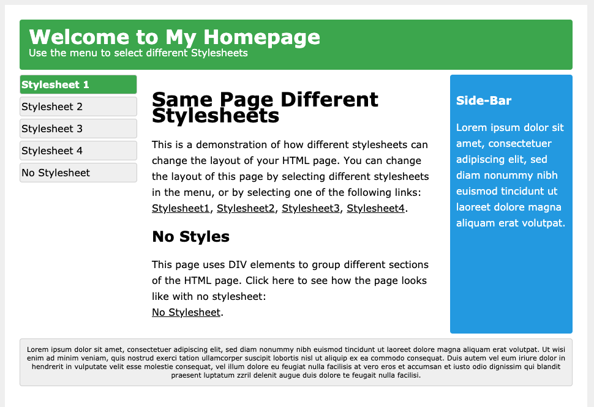
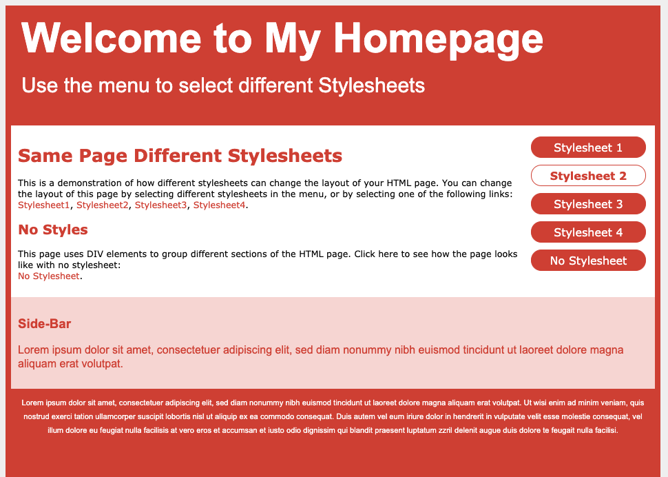
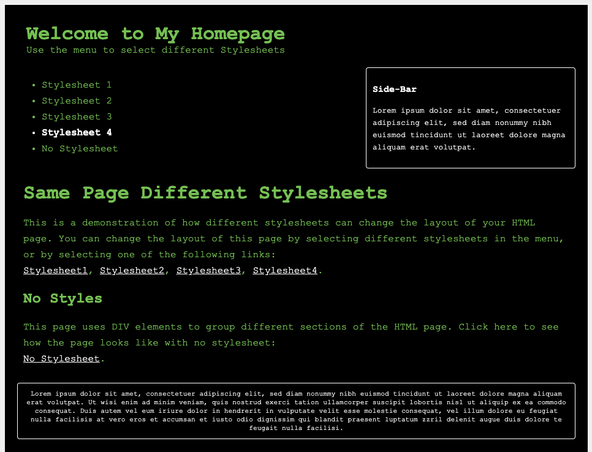
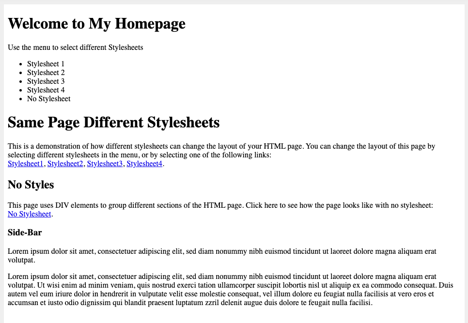
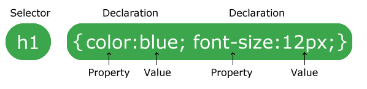

# CSS HOME

CSS es un lenguaje que describe el estilo de un documento HTML.

CSS describe cómo deben mostrarse los elementos HTML.

Este tutorial le enseñará CSS de básico a avanzado.

### Ejemplos en cada capítulo

Este tutorial de CSS contiene cientos de ejemplos de CSS.

Con nuestro editor en línea, puede editar el CSS y hacer clic en un botón para ver el resultado.

#### Ejemplo CSS

```css
body {
  background-color: lightblue;
}

h1 {
  color: white;
  text-align: center;
}

p {
  font-family: verdana;
  font-size: 20px;
}
```
:computer:

## CSS Introduction

### ¿Qué es el CSS?

* **CSS** significa **C** ascading **S** tyle **S** heets
* CSS describe **cómo se deben mostrar los elementos HTML en la pantalla, papel o en otros medios**
* CSS **ahorra mucho trabajo** . Puede controlar el diseño de varias páginas web a la vez
* Las hojas de estilo externas se almacenan en **archivos CSS**

### Demostración CSS - Una página HTML - ¡Múltiples estilos!

Aquí mostraremos una página HTML que se muestra con cuatro hojas de estilo diferentes. Haga clic en los enlaces ""Stylesheet 1", "Stylesheet 2", "Stylesheet 3", "Stylesheet 4" a continuación para ver los diferentes estilos:










### ¿Por qué usar CSS?

CSS se utiliza para definir estilos para sus páginas web, incluido el diseño, el diseño y las variaciones de visualización para diferentes dispositivos y tamaños de pantalla.

#### Ejemplo CSS

```css
body {
  background-color: lightblue;
}

h1 {
  color: white;
  text-align: center;
}

p {
  font-family: verdana;
  font-size: 20px;
}
```

:computer:

### CSS resolvió un gran problema

¡HTML nunca tuvo la intención de contener etiquetas para formatear una página web!

HTML fue creado para **describir el contenido** de una página web, como:

`<h1>` Este es un encabezado `</h1>`

`<p>` Este es un párrafo. `</p>`

Cuando se agregaron etiquetas como `<font>` y atributos de color a la especificación HTML 3.2, comenzó una pesadilla para los desarrolladores web. El desarrollo de sitios web grandes, donde se agregaron fuentes e información de color a cada página, se convirtió en un proceso largo y costoso.

Para resolver este problema, el Consorcio World Wide Web (W3C) creó CSS.

¡CSS eliminó el formato de estilo de la página HTML!

### ¡CSS ahorra mucho trabajo!

Las definiciones de estilo se guardan normalmente en archivos externos `.css`.

¡Con un archivo de hoja de estilo externo, puede cambiar el aspecto de un sitio web completo cambiando solo un archivo!

## Sintaxis CSS

### Sintaxis CSS

Un conjunto de reglas CSS consta de un selector y un bloque de declaración:



El selector apunta al elemento HTML que desea diseñar.

El bloque de declaración contiene una o más declaraciones separadas por punto y coma.

Cada declaración incluye un nombre de propiedad CSS y un valor, separados por dos puntos.

Una declaración CSS siempre termina con un punto y coma, y los bloques de declaración están rodeados por llaves.

#### Ejemplo

En este ejemplo, todos los elementos `<p>` estarán alineados al centro, con un color de texto rojo:

```css
p {
  color: red;
  text-align: center;
}
```

:computer:

Ejemplo explicado

* `p` es un **selector** en CSS (apunta al elemento HTML que desea diseñar: `<p>`).
* `color`es una propiedad y `red`es el valor de la propiedad
* `text-align`es una propiedad y `center`es el valor de la propiedad

## CSS Selectors
## CSS How To
## CSS Comments
## CSS Colors
## CSS Backgrounds
## CSS Borders
## CSS Margins
## CSS Padding
## CSS Height/Width
## CSS Box Model
## CSS Outline
## CSS Text
## CSS Fonts
## CSS Icons
## CSS Links
## CSS Lists
## CSS Tables
## CSS Display
## CSS Max-width
## CSS Position
## CSS Overflow
## CSS Float
## CSS Inline-block
## CSS Align
## CSS Combinators
## CSS Pseudo-class
## CSS Pseudo-element
## CSS Opacity
## CSS Navigation Bar
## CSS Dropdowns
## CSS Image Gallery
## CSS Image Sprites
## CSS Attr Selectors
## CSS Forms
## CSS Counters
## CSS Website Layout
## CSS Units
## CSS Specificity
