# CSS HOME

CSS es un lenguaje que describe el estilo de un documento HTML.

CSS describe cómo deben mostrarse los elementos HTML.

Este tutorial le enseñará CSS de básico a avanzado.

### Ejemplos en cada capítulo

Este tutorial de CSS contiene cientos de ejemplos de CSS.

Con nuestro editor en línea, puede editar el CSS y hacer clic en un botón para ver el resultado.

#### Ejemplo CSS

```css
body {
  background-color: lightblue;
}

h1 {
  color: white;
  text-align: center;
}

p {
  font-family: verdana;
  font-size: 20px;
}
```
:computer:

## CSS Introduction

### ¿Qué es el CSS?

* **CSS** significa **C** ascading **S** tyle **S** heets
* CSS describe **cómo se deben mostrar los elementos HTML en la pantalla, papel o en otros medios**
* CSS **ahorra mucho trabajo** . Puede controlar el diseño de varias páginas web a la vez
* Las hojas de estilo externas se almacenan en **archivos CSS**

### Demostración CSS - Una página HTML - ¡Múltiples estilos!

Aquí mostraremos una página HTML que se muestra con cuatro hojas de estilo diferentes. Haga clic en los enlaces ""Stylesheet 1", "Stylesheet 2", "Stylesheet 3", "Stylesheet 4" a continuación para ver los diferentes estilos:

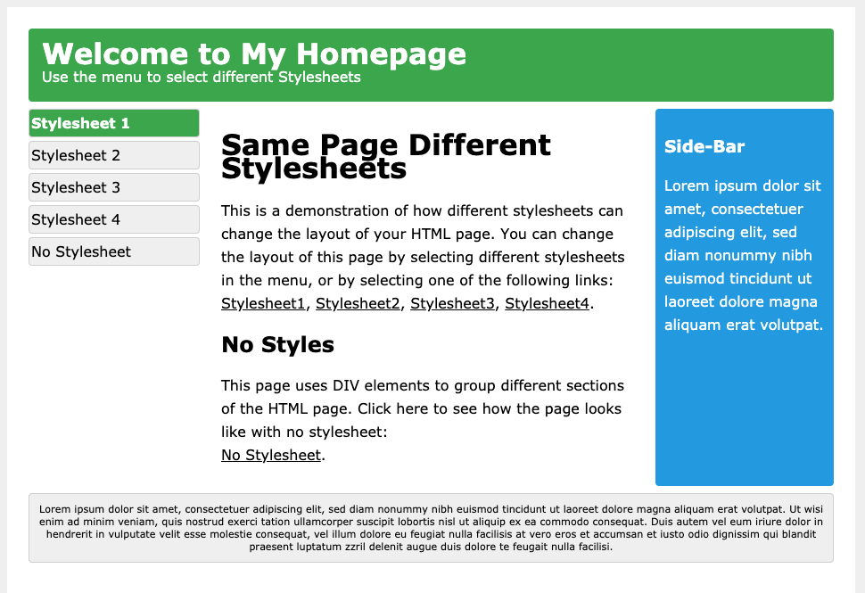


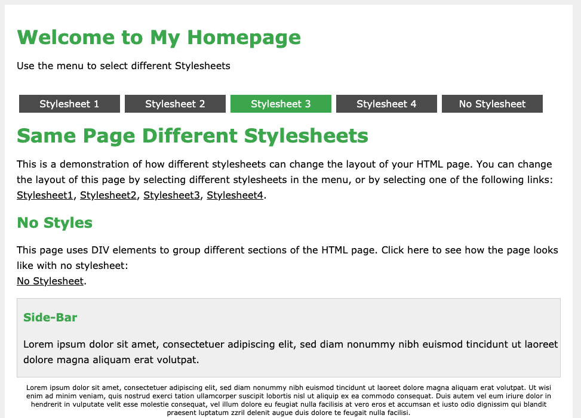


### ¿Por qué usar CSS?

CSS se utiliza para definir estilos para sus páginas web, incluido el diseño, el diseño y las variaciones de visualización para diferentes dispositivos y tamaños de pantalla.

#### Ejemplo CSS

```css
body {
  background-color: lightblue;
}

h1 {
  color: white;
  text-align: center;
}

p {
  font-family: verdana;
  font-size: 20px;
}
```

:computer:

### CSS resolvió un gran problema

¡HTML nunca tuvo la intención de contener etiquetas para formatear una página web!

HTML fue creado para **describir el contenido** de una página web, como:

`<h1>` Este es un encabezado `</h1>`

`<p>` Este es un párrafo. `</p>`

Cuando se agregaron etiquetas como `<font>` y atributos de color a la especificación HTML 3.2, comenzó una pesadilla para los desarrolladores web. El desarrollo de sitios web grandes, donde se agregaron fuentes e información de color a cada página, se convirtió en un proceso largo y costoso.

Para resolver este problema, el Consorcio World Wide Web (W3C) creó CSS.

¡CSS eliminó el formato de estilo de la página HTML!

### ¡CSS ahorra mucho trabajo!

Las definiciones de estilo se guardan normalmente en archivos externos `.css`.

¡Con un archivo de hoja de estilo externo, puede cambiar el aspecto de un sitio web completo cambiando solo un archivo!

## Sintaxis CSS

### Sintaxis CSS

Un conjunto de reglas CSS consta de un selector y un bloque de declaración:


El selector apunta al elemento HTML que desea diseñar.

El bloque de declaración contiene una o más declaraciones separadas por punto y coma.

Cada declaración incluye un nombre de propiedad CSS y un valor, separados por dos puntos.

Una declaración CSS siempre termina con un punto y coma, y los bloques de declaración están rodeados por llaves.

#### Ejemplo

En este ejemplo, todos los elementos `<p>` estarán alineados al centro, con un color de texto rojo:

```css
p {
  color: red;
  text-align: center;
}
```

:computer:

Ejemplo explicado

* `p` es un **selector** en CSS (apunta al elemento HTML que desea diseñar: `<p>`).
* `color`es una propiedad y `red`es el valor de la propiedad
* `text-align`es una propiedad y `center`es el valor de la propiedad

## CSS Selectors (Selectores CSS)

Los selectores CSS se utilizan para "encontrar" (o seleccionar) los elementos HTML que desea diseñar.

Podemos dividir los selectores CSS en cinco categorías:

* **Simple selectors** (seleccione elementos basados en name, id, class)
* **Combinator selectors** (seleccione elementos basados en una relación específica entre ellos)
* **Pseudo-class selectors** (seleccione elementos basados en un cierto estado)
* **Pseudo-elements selectors** (seleccionar y diseñar una parte de un elemento)
* **Attribute selectors** (seleccione elementos basados en un atributo o valor de atributo)

Esta página explicará los selectores CSS más básicos.

### El CSS element Selector (Selector de elementos CSS)

El selector de elementos selecciona elementos HTML en función del nombre del elemento.

#### Ejemplo

Aquí, todos los elementos `<p>` de la página estarán alineados al centro, con un color de texto rojo: 

```css
p {
  text-align: center;
  color: red;
}
```

:computer:

### El CSS id Selector Selector id CSS)

El selector `id` utiliza el atributo `id` de un elemento HTML para seleccionar un elemento específico.

El `id` de un elemento es única dentro de una página, por lo que el selector `id` se usa para seleccionar un elemento único!

Para seleccionar un elemento con un `id` específico, escriba un carácter hash (#), seguido de la identificación del elemento.

#### Ejemplo

La siguiente regla CSS se aplicará al elemento HTML con `id = "para1"`: 

```css
#para1 {
  text-align: center;
  color: red;
}
```

:computer:

**Nota:** ¡Un id name no puede comenzar con un número!

### El CSS class Selector (Selector class)

El selector class selecciona elementos HTML con un atributo `class` específico.

Para seleccionar elementos con una clase específica, escriba un carácter de punto (.), Seguido del nombre de la clase.

#### Ejemplo

En este ejemplo, todos los elementos HTML con `class = "center"` serán rojos y alineados al centro: 


```css
.center {
  text-align: center;
  color: red;
}
```

:computer:

También puede especificar que solo los elementos HTML específicos se vean afectados por una clase.

#### Ejemplo

En este ejemplo, solo los elementos `<p>` con `class = "center"` estarán alineados al centro: 

```sh
p.center {
  text-align: center;
  color: red;
}
```

:computer:

Los elementos HTML también pueden referirse a más de una clase.

#### Ejemplo

En este ejemplo, el elemento `<p>` se diseñará de acuerdo con `class = "center"` y a `class = "large"`: 

```sh
<p class="center large">This paragraph refers to two classes.</p>
```

:computer:

**Nota:** ¡Un nombre de clase no puede comenzar con un número!

### El CSS Universal Selector

El selector universal (`*`) selecciona todos los elementos HTML en la página.

#### Ejemplo

La siguiente regla CSS afectará a cada elemento HTML en la página: 

```css
* {
  text-align: center;
  color: blue;
}
```

:computer:


### El CSS Grouping Selector (Selector de Agrupación)

El selector de agrupación selecciona todos los elementos HTML con las mismas definiciones de estilo.

Mire el siguiente código CSS (los elementos `h1`, `h2` y `p` tienen las mismas definiciones de estilo):

```css
h1 {
  text-align: center;
  color: red;
}

h2 {
  text-align: center;
  color: red;
}

p {
  text-align: center;
  color: red;
}
```

Será mejor agrupar los selectores para minimizar el código.

Para agrupar selectores, separe cada selector con una coma.

#### Ejemplo

En este ejemplo, hemos agrupado los selectores del código anterior: 

```css
h1, h2, p {
  text-align: center;
  color: red;
}
```

:computer:

### ¡Ponte a Prueba con Ejercicios!

:computer: :computer: :computer: :computer:

### Todos CSS Simple Selectors

Selector | Example | Example description
---------|---------|--------------------
`.class` | `.intro` | Selecciona todos los elementos con `class = "intro"`
`#id` | `#firstname` | Selecciona el elemento con `id="firstname"`
`*` | `*` | Selecciona todos los elementos.
`element` | `p` | Selecciona todos los elementos `<p>`
`element,element,..` | `div, p` | Selecciona todos los elementos `<div>` y todos los elementos `<p>`

## Como Añadir CSS

Cuando un navegador lee una hoja de estilo, está formateará el documento HTML de acuerdo con la información en la hoja de estilo.

### Tres Formas de Insertar CSS

Hay tres formas de insertar una hoja de estilo:

* CSS externo
* CSS interno
* CSS en línea

### CSS externo

¡Con una hoja de estilo externa, puede cambiar el aspecto de un sitio web completo cambiando solo un archivo!

Cada página HTML debe incluir una referencia al archivo de hoja de estilo externo dentro del elemento `<link>`, dentro de la sección de encabezado(head) .

#### Ejemplo

Los estilos externos se definen dentro del elemento `<link>`, dentro de la sección `<head>` de una página HTML:

```css
<!DOCTYPE html>
<html>
<head>
  <link rel="stylesheet" type="text/css" href="mystyle.css">
</head>
<body>

  <h1>This is a heading</h1>
  <p>This is a paragraph.</p>

</body>
</html>
```

:computer:


Se puede escribir una hoja de estilo externa en cualquier editor de texto y se debe guardar con una extensión .css.

El archivo externo .css no debe contener ninguna etiqueta HTML.

Así es como se ve el archivo "mystyle.css":

#### "mystyle.css"

```css
body {
  background-color: lightblue;
}

h1 {
  color: navy;
  margin-left: 20px;
}
```

**Nota**: No agregue un espacio entre el valor de la propiedad y la unidad (como `margin-left: 20 px;`). La forma correcta es: `margin-left: 20px;`

### CSS interno

Se puede usar una hoja de estilo interna si una sola página HTML tiene un estilo único.

El estilo interno se define dentro del elemento `<style>`, dentro de la sección del encabezado.

#### Ejemplo

Los estilos internos se definen dentro del elemento `<style>`, dentro de la sección `<head> de una página HTML:
  
```css
<!DOCTYPE html>
<html>
<head>
  <style>
    body {
      background-color: linen;
    }

    h1 {
      color: maroon;
      margin-left: 40px;
    }
  </style>
</head>
<body>

  <h1>This is a heading</h1>
  <p>This is a paragraph.</p>

</body>
</html>
```

:computer:

### CSS Inline

Se puede usar un estilo inline para aplicar un estilo único para un solo elemento.

Para usar estilos inline, agregue el atributo `style` al elemento relevante. El atributo `style` puede contener cualquier propiedad CSS.

#### Ejemplo

Los estilos inline se definen dentro del atributo `style` del elemento relevante:

```css
<!DOCTYPE html>
<html>
<body>

  <h1 style="color:blue;text-align:center;">This is a heading</h1>
  <p style="color:red;">This is a paragraph.</p>

</body>
</html>
```

:computer:

**Tip**: Un estilo inline pierde muchas de las ventajas de una hoja de estilo (al mezclar contenido con presentación). Use este método con moderación.

### Múltiples Hojas de Estilo (Style Sheets)

Si se han definido algunas propiedades para el mismo selector (elemento) en diferentes hojas de estilo, se utilizará el valor de la última hoja de estilo leída. 

Suponga que una **hoja de estilo externa** tiene el siguiente estilo para el elemento `<h1>`:

```css
h1 {
  color: navy;
}
```

Luego, suponga que una **hoja de estilo interna** también tiene el siguiente estilo para el elemento `<h1>`:
  
```css
h1 {
  color: orange;   
}
```

#### Ejemplo

Si el estilo interno se define **después** del enlace a la hoja de estilo externa, los elementos `<h1>` serán `"orange"`:

```css
<head>
  <link rel="stylesheet" type="text/css" href="mystyle.css">
  <style>
    h1 {
      color: orange;
    }
  </style>
</head>
```

:computer:

#### Ejemplo

Sin embargo, si el estilo interno se define **antes** del enlace a la hoja de estilo externa, los elementos `<h1>` serán `"navy"`: 
  
```css
<head>
  <style>
    h1 {
      color: orange;
    }
  </style>
  <link rel="stylesheet" type="text/css" href="mystyle.css">
</head>
```

:computer:

### Orden en Cascada

¿Qué estilo se usará cuando haya más de un estilo especificado para un elemento HTML?

Todos los estilos de una página se "encadenarán" en una nueva hoja de estilo "virtual" según las siguientes reglas, donde el número uno tiene la máxima prioridad:

1. Estilo en línea (dentro de un elemento HTML)
2. Hojas de estilo externas e internas (en la sección head)
3. Navegador predeterminado

Por lo tanto, un estilo en línea tiene la máxima prioridad y anulará los estilos externos e internos y los valores predeterminados del navegador.

:computer:

### ¡Ponte a prueba con ejercicios!

:computer: :computer: :computer: :computer:

## CSS Comments

### Comentarios CSS

Los comentarios se utilizan para explicar el código y pueden ser útiles cuando edite el código fuente en una fecha posterior.

Los comentarios son ignorados por los navegadores.

Un comentario CSS comienza con `/*` y termina con `*/`:

#### Ejemplo

```css
/* This is a single-line comment */
p {
  color: red;
}
```

:computer:

Puedes agregar comentarios donde quieras en el código:

#### Ejemplo

```css
p {
  color: red;  /* Set text color to red */
}
```

:computer:

Los comentarios también pueden abarcar varias líneas: 

#### Ejemplo

```css
/* This is
a multi-line
comment */

p {
  color: red;
}
```

:computer:

## CSS Colors

Los colores se especifican utilizando nombres de color predefinidos o valores RGB, HEX, HSL, RGBA, HSLA.

### Nombres de color CSS

En CSS, se puede especificar un color utilizando un nombre de color:

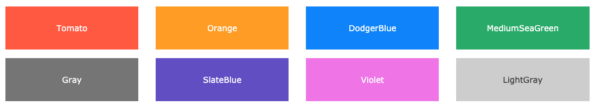

:computer:

CSS/HTML soporta [140 nombres de color standard](https://www.w3schools.com/colors/colors_names.asp).

### CSS Background Color

Puede establecer el color de fondo para los elementos HTML:

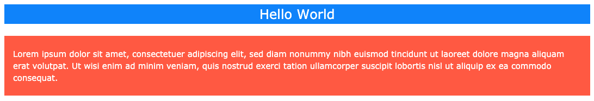

#### Ejemplo

```css
<h1 style="background-color:DodgerBlue;">Hello World</h1>
<p style="background-color:Tomato;">Lorem ipsum...</p>
```

:computer:

### CSS Text Color

Puedes configurar el color del texto:

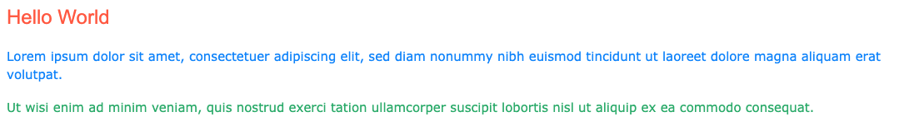

#### Ejemplo

```css
<h1 style="color:Tomato;">Hello World</h1>
<p style="color:DodgerBlue;">Lorem ipsum...</p>
<p style="color:MediumSeaGreen;">Ut wisi enim...</p>
```

:computer:

### CSS Border Color

Puede configurar el color de los bordes:

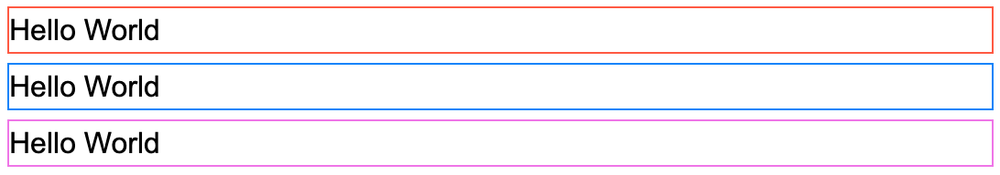

#### Ejemplo

```css
<h1 style="border:2px solid Tomato;">Hello World</h1>
<h1 style="border:2px solid DodgerBlue;">Hello World</h1>
<h1 style="border:2px solid Violet;">Hello World</h1>
```

:computer:

### CSS Color Values

En CSS, los colores también se pueden especificar utilizando valores RGB, valores HEX, valores HSL, valores RGBA y valores HSLA:

Igual que el nombre de color `"Tomato"`:

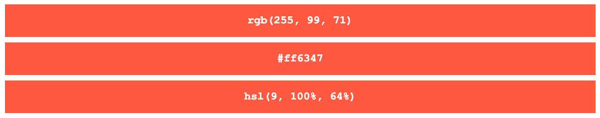

Igual que el nombre de color `"Tomato"`, pero 50% transparente:

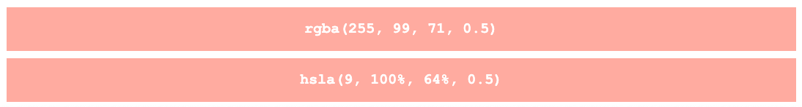

#### Ejemplo

```css
<h1 style="background-color:rgb(255, 99, 71);">...</h1>
<h1 style="background-color:#ff6347;">...</h1>
<h1 style="background-color:hsl(9, 100%, 64%);">...</h1>

<h1 style="background-color:rgba(255, 99, 71, 0.5);">...</h1>
<h1 style="background-color:hsla(9, 100%, 64%, 0.5);">...</h1>
```

:computer:

## CSS RGB Colors

### RGB Value

En CSS, un color se puede especificar como un valor RGB, usando esta fórmula:

**`rgb(red, green, blue)`**

Cada parámetro (rojo, verde y azul) define la intensidad del color entre 0 y 255.

Por ejemplo, rgb (255, 0, 0) se muestra en rojo, porque el rojo se establece en su valor más alto (255) y los demás se establecen en 0.

Para mostrar el negro, establezca todos los parámetros de color en 0, de esta manera: rgb (0, 0, 0).

Para mostrar el blanco, configure todos los parámetros de color en 255, así: rgb (255, 255, 255).

Experimente mezclando los valores RGB a continuación:

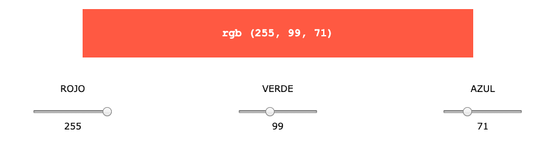

#### Ejemplos

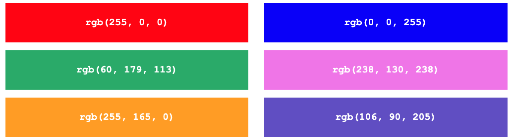

:computer:

Los tonos de gris a menudo se definen utilizando valores iguales para las 3 fuentes de luz:

#### Ejemplos

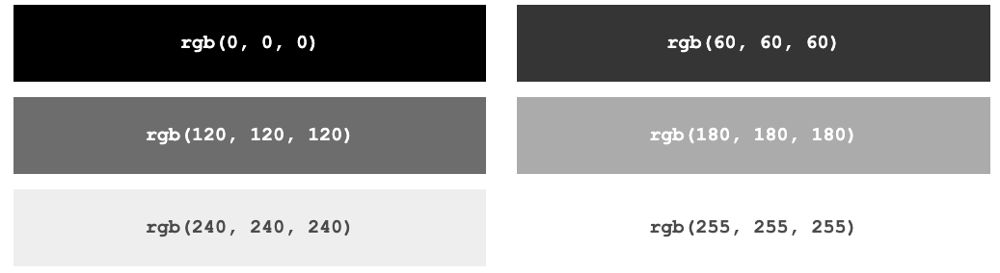

:computer:
*********************************
### RGBA Value

Los valores de color RGBA son una extensión de los valores de color RGB con un canal alfa, que especifica la opacidad de un color.

Un valor de color RGBA se especifica con:

**`rgba(red, green, blue, alpha)`**

El parámetro alfa es un número entre 0.0 (totalmente transparente) y 1.0 (no transparente en absoluto):

Experimente mezclando los valores de RGBA a continuación:

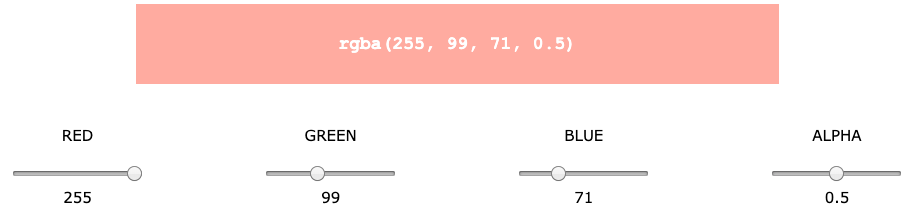

#### Ejemplo:

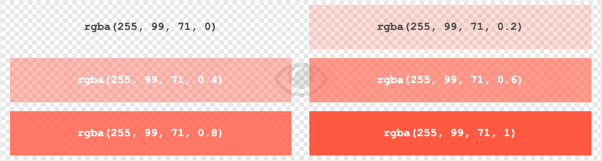

:computer:

## CSS HEX Colors

### HEX Value

En CSS, se puede especificar un color usando un valor hexadecimal en la forma:

**`#rrggbb`**

Donde rr (red), gg (green) y bb (blue) son valores hexadecimales entre 00 y ff (decimales entre 0-255).

Por ejemplo, `#ff0000` se muestra en rojo, porque el rojo se establece en su valor más alto (ff) y los demás se configuran en el valor más bajo (00).

Experimente mezclando los valores HEX a continuación:

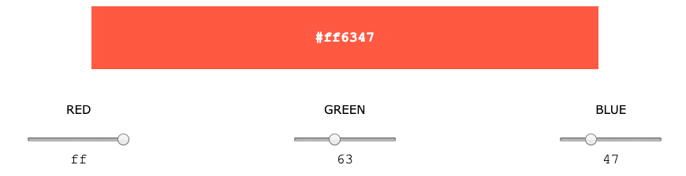

#### Ejemplo

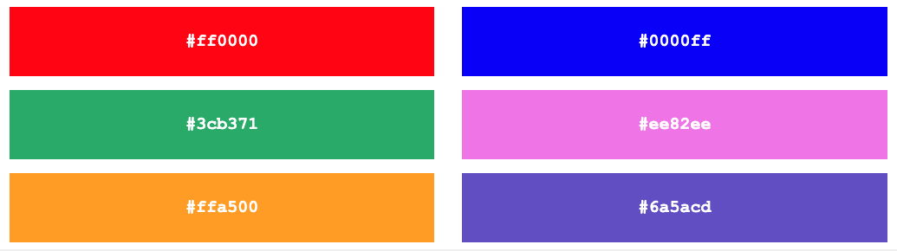

:computer:

Los tonos de gris a menudo se definen utilizando valores iguales para las 3 fuentes de luz:

#### Ejemplo

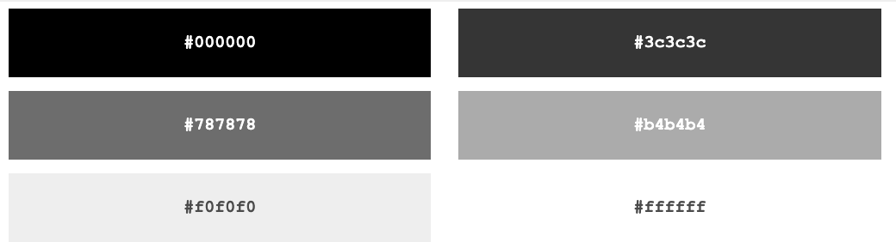

:computer:

## CSS HSL Colors

### HSL Value

En CSS, se puede especificar un color usando hue (matiz), saturation (saturación), y lightnessmatiz (luminosidad),  (HSL) en la forma:

**`hsl(hue, saturation, lightness)`**

Hue es un grado en la rueda de color de 0 a 360. 0 es red, 120 es green y 240 es blue.

Saturation es un valor porcentual, 0% significa un tono de gris y 100% es el color completo.

Lightness también es un porcentaje, el 0% es negro, el 50% no es claro ni oscuro, el 100% es blanco

Experimente mezclando los valores de HSL a continuación:

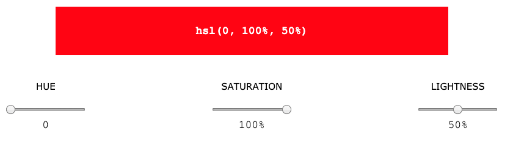

#### Ejemplo


:computer:

#### Saturation

La saturación se puede describir como la intensidad de un color.

100% es color puro, sin tonos de gris

50% es 50% gris, pero aún puede ver el color.

0% es completamente gris, ya no puede ver el color.

#### Ejemplo

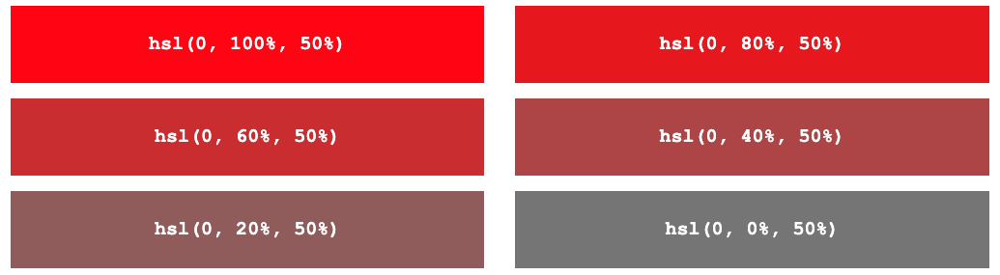

:computer:

#### Lightness

La claridad de un color puede describirse como la cantidad de luz que desea dar al color, donde 0% significa que no hay luz (negro), 50% significa 50% de luz (ni oscura ni clara) 100% significa claridad total (blanco).

#### Ejemplo

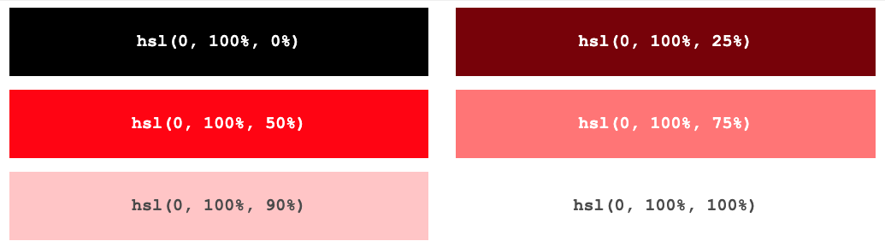

:computer:

Los tonos de gris a menudo se definen estableciendo el tono y la saturación en 0, y ajustando la claridad del 0% al 100% para obtener tonos más oscuros / claros:

#### Ejemplo

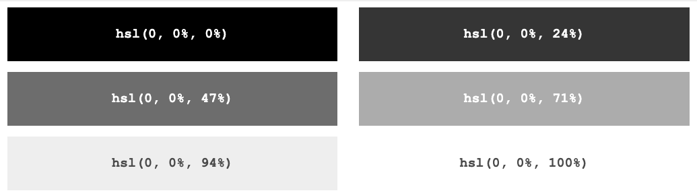

:computer:

### HSLA Value

Los valores de color HSLA son una extensión de los valores de color HSL con un canal alfa, que especifica la opacidad de un color.

Un valor de color HSLA se especifica con:

**`hsla(hue, saturation, lightness, alpha)`**

El parámetro alfa es un número entre 0.0 (totalmente transparente) y 1.0 (no transparente en absoluto):

Experimente mezclando los valores de HSLA a continuación:

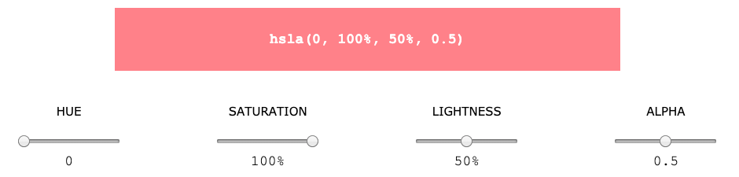

#### Ejemplo

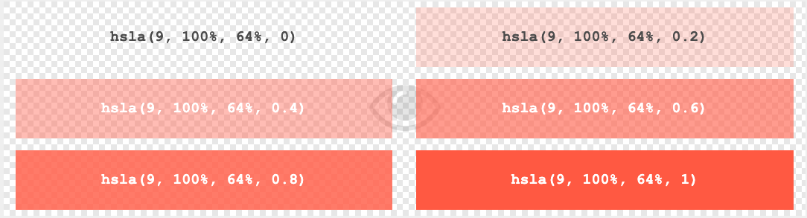

:computer:

## CSS Backgrounds

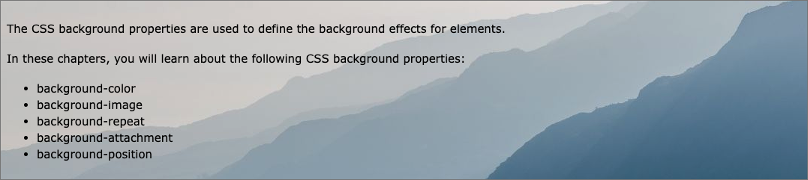

### CSS background-color

La propiedad `background-color` especifica el color de fondo(background) de un elemento.

#### Ejemplo

El color de fondo de una página se establece así:

```css
body {
  background-color: lightblue;
}
```

:computer:

Con CSS, un color se especifica con mayor frecuencia por:

* un nombre de color válido, como `"red"`
* un valor HEX - como `"#ff0000"`
* un valor RGB, como `"rgb(255,0,0)"`
Mire los [valores de color CSS](https://www.w3schools.com/cssref/css_colors_legal.asp) para obtener una lista completa de posibles valores de color.

#### Ejemplo

Aquí, los elementos `<h1>`, `<p>` y `<div>` tendrán diferentes colores de fondo: 

```css
h1 {
  background-color: green;
}

div {
  background-color: lightblue;
}

p {
  background-color: yellow;
}
```

:computer:

## CSS Background Image

### CSS background-image

La propiedad `background-image` especifica una imagen para usar como fondo de un elemento.

Por defecto, la imagen se repite para que cubra todo el elemento.

#### Ejemplo

La imagen de fondo para una página se puede configurar así: 

```css
body {
  background-image: url("paper.gif");
}
```

:computer:

#### Ejemplo

Este ejemplo muestra una mala combinación de texto e imagen de fondo. El texto es difícil de leer: 

```css
body {
  background-image: url("bgdesert.jpg");
}
```

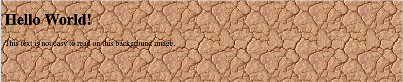

:computer:

**Nota**: Cuando use una imagen de fondo, use una imagen que no altere el texto.

## CSS Background Repeat

### CSS background-repeat

Por defecto, la propiedad `background-image` repite una imagen tanto horizontal como verticalmente.

Algunas imágenes deben repetirse solo horizontal o verticalmente, o se verán extrañas, así:

#### Ejemplo

```css
body {
  background-image: url("gradient_bg.png");
}
```

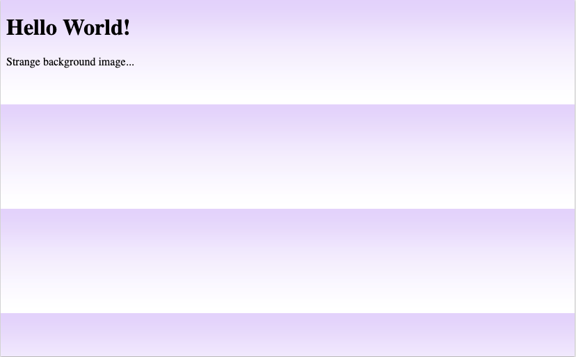

:computer:

Si la imagen de arriba se repite solo horizontalmente (`background-repeat: repeat-x;`), el fondo se verá mejor:

#### Ejemplo

```css
body {
  background-image: url("gradient_bg.png");
  background-repeat: repeat-x;
}
```

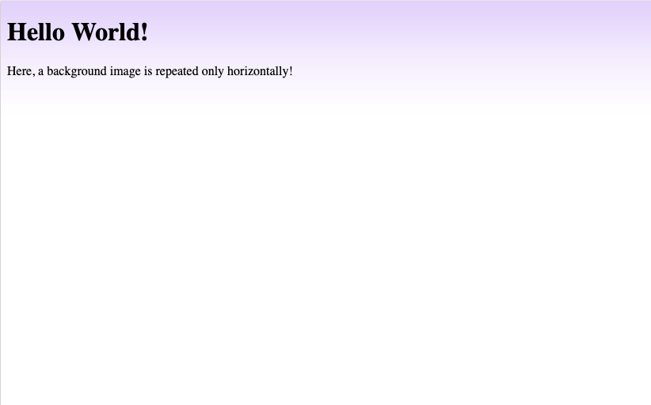

:computer:

**Tip**: para repetir una imagen verticalmente, configure `background-repeat: repeat-y;`

### CSS background-repeat: no-repeat

Mostrar la imagen de fondo solo una vez también está especificado por la propiedad `background-repeat`:

#### Ejemplo

Mostrar la imagen de fondo solo una vez:

```css
body {
  background-image: url("img_tree.png");
  background-repeat: no-repeat;
}
```

:computer:

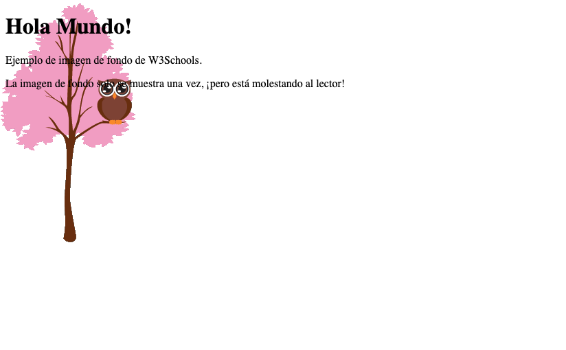

En el ejemplo anterior, la imagen de fondo se coloca en el mismo lugar que el texto. Queremos cambiar la posición de la imagen, para que no altere demasiado el texto.

### CSS background-position

La propiedad `background-position` se utiliza para especificar la posición de la imagen de fondo.

#### Ejemplo

Coloque la imagen de fondo en la esquina superior derecha: 

```css
body {
  background-image: url("img_tree.png");
  background-repeat: no-repeat;
  background-position: right top;
}
```

:computer:

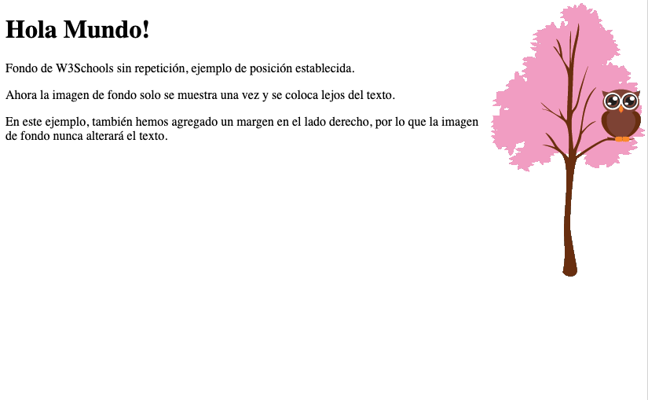

## CSS Background Attachment

### CSS background-attachment

La propiedad `background-attachment` especifica si la imagen de fondo debe desplazarse o estar fija (no se desplazará con el resto de la página):

#### Ejemplo

Especifique que la imagen de fondo debe estar fija:

```css
body {
  background-image: url("img_tree.png");
  background-repeat: no-repeat;
  background-position: right top;
  background-attachment: fixed;
}
```

:computer:

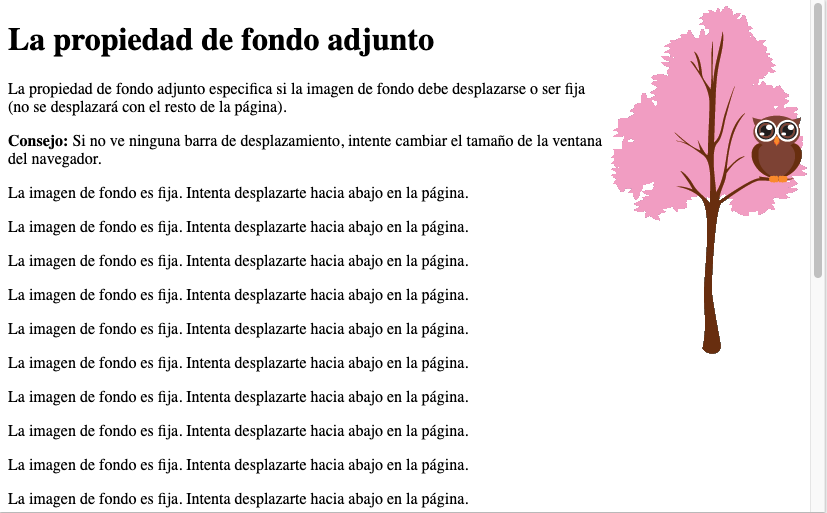

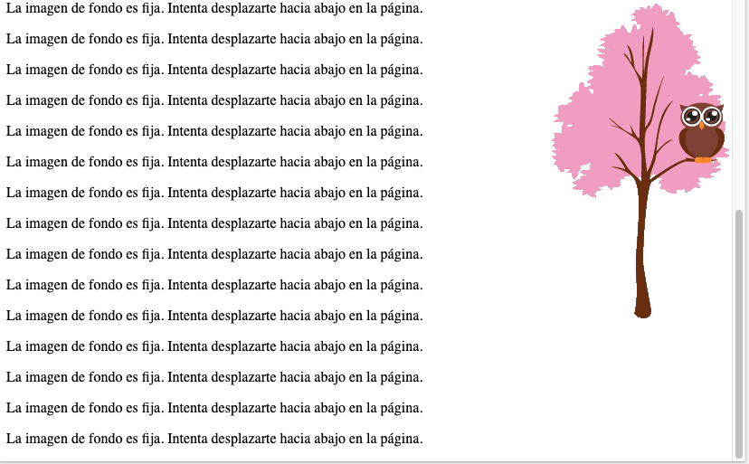

#### Ejemplo

Especifique que la imagen de fondo debe desplazarse con el resto de la página:

```css
body {
  background-image: url("img_tree.png");
  background-repeat: no-repeat;
  background-position: right top;
  background-attachment: scroll;
}
```

:computer:

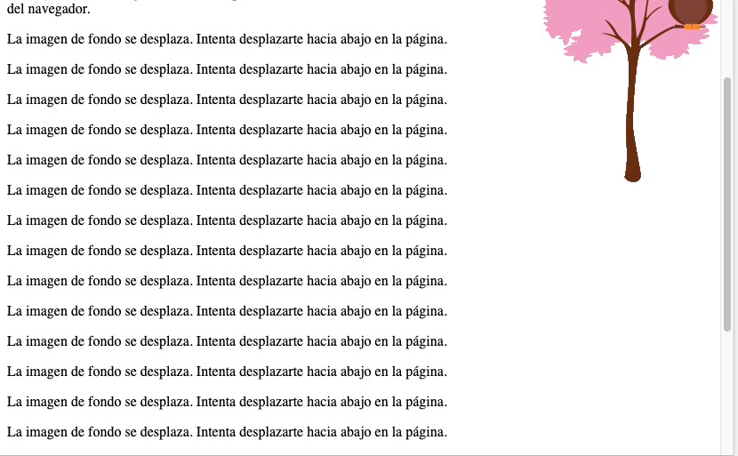

### CSS Background Shorthand

#### CSS background - Shorthand property

Para acortar el código, también es posible especificar todas las propiedades de fondo en una sola propiedad. Esto se llama propiedad abreviada.

La propiedad abreviada para el fondo es background.

#### Ejemplo

Use la propiedad abreviada para establecer todas las propiedades de fondo en una declaración:

```css
body {
  background: #ffffff url("img_tree.png") no-repeat right top;
}
```

:computer:

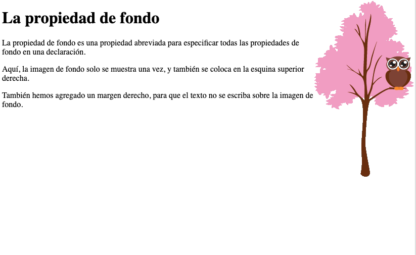

Cuando se utiliza la propiedad abreviada, el orden de los valores de la propiedad es:

* background-color
* background-image
* background-repeat
* background-attachment
* background-position

No importa si falta uno de los valores de propiedad, siempre que los otros estén en este orden.

### ¡Ponte a prueba con ejercicios!

:computer: :computer: :computer: :computer:

Todas las Propiedades CSS Background

Propiedad | Descripción
----------|------------
background | Establece todas las propiedades background en una declaración
background-attachment | Establece si una imagen background es fija o se desplaza con el resto de la página
background-clip | Especifica el área de pintura del background
background-color | Establece el color de background de un elemento
background-image | Colocar la imagen background para un elemento
background-origin | Especificar donde la(s) imagen(es) es/son posicionadas
background-position | Colocar la posición inicial de imagen background
background-repeat | Indicar como una imagen background rerá repetida
background-size | Especificar el tamaño de imagen(es) background

## CSS Borders

### CSS Border Properties

Las propiedades CSS `border` le permiten especificar el estilo, el ancho y el color del borde de un elemento.

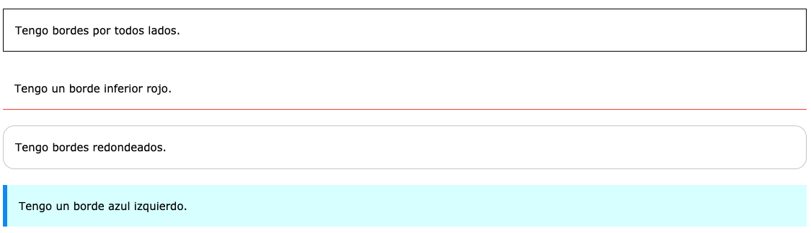

### CSS Border Style

La propiedad `border-style` especifica qué tipo de borde mostrar.

Se permiten los siguientes valores:

* `dotted` - Define un dotted border
* `dashed` - Define un  dashed border
* `solid` - Define un  solid border
* `double` - Define un double border
* `groove` - Define un 3D grooved border. El efecto depende del valor de `border-color`.
* `ridge` - Define un 3D ridged border. El efecto depende del valor de `border-color`.
* `inset` - Define un 3D inset border. El efecto depende del valor de `border-color`.
* `outset` - Define un 3D outset border. El efecto depende del valor de `border-color`.
* `none` - Define no border
* `hidden` - Define un hidden border

La propiedad `border-style` puede tener de uno a cuatro valores (para el top border, right border, bottom border, y el left border).

#### Ejemplo

Demostración de los diferentes estilos de borde:

```css
p.dotted {border-style: dotted;}
p.dashed {border-style: dashed;}
p.solid {border-style: solid;}
p.double {border-style: double;}
p.groove {border-style: groove;}
p.ridge {border-style: ridge;}
p.inset {border-style: inset;}
p.outset {border-style: outset;}
p.none {border-style: none;}
p.hidden {border-style: hidden;}
p.mix {border-style: dotted dashed solid double;}
```

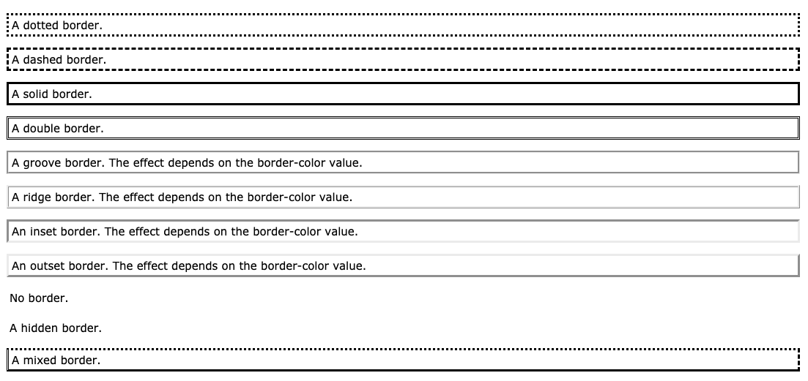

**Nota**: ¡Ninguna de las OTRAS propiedades de borde CSS (de las que aprenderá más en los próximos capítulos) tendrá NINGÚN efecto a menos que se establezca la propiedad `border-style`!

## CSS Border Width

### CSS Border Width

La propiedad `border-width` especifica el ancho de los cuatro bordes.

El ancho se puede establecer como un tamaño específico (in px, pt, cm, em, etc.) o mediante el uso de uno de los tres valores predefinidos: thin, medium, o thick:

#### Ejemplo

Demostración de los diferentes anchos de borde:

```css
p.one {
  border-style: solid;
  border-width: 5px;
}

p.two {
  border-style: solid;
  border-width: medium;
}

p.three {
  border-style: dotted;
  border-width: 2px;
}

p.four {
  border-style: dotted;
  border-width: thick;
}
```

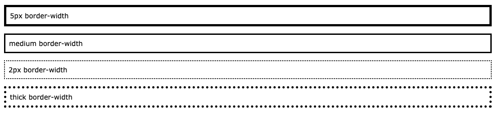

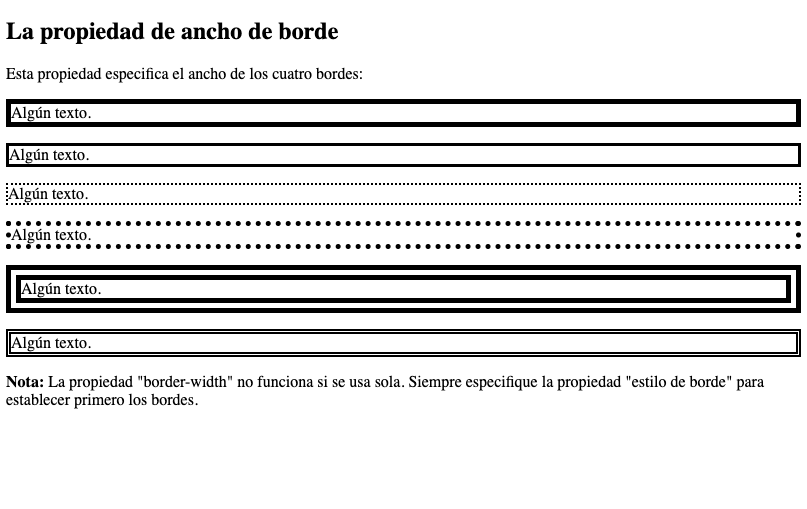

:computer:

### Especificar Side Widths

La propiedad `border-width` puede tener de uno a cuatro valores (para el top border, right border, bottom border, y el left border):

Ejemplo:

```css
p.one {
  border-style: solid;
  border-width: 5px 20px; /* 5px top and bottom, 20px on the sides */
}

p.two {
  border-style: solid;
  border-width: 20px 5px; /* 20px top and bottom, 5px on the sides */
}

p.three {
  border-style: solid;
  border-width: 25px 10px 4px 35px; /* 25px top, 10px right, 4px bottom and 35px left
}
```


:computer:

## CSS Border Color

### CSS Border Color

La propiedad `border-color` se utiliza para establecer el color de los cuatro bordes.

El color puede ser establecido por:

* **name** - especifique un nombre de color, como "red"
* **HEX** - especifique un HEX value, como "#ff0000"
* **RGB** - especifique un RGB value, como "rgb(255,0,0)"
* **HSL** - especifique un HSL value, como "hsl(0, 100%, 50%)"
* **transparent**

**Nota**: Si no se establece el color del borde, hereda el color del elemento.

#### Ejemplo

Demostración de los diferentes colores del borde:

```css
p.one {
  border-style: solid;
  border-color: red;
}

p.two {
  border-style: solid;
  border-color: green;
}

p.three {
  border-style: dotted;
  border-color: blue;
}
```

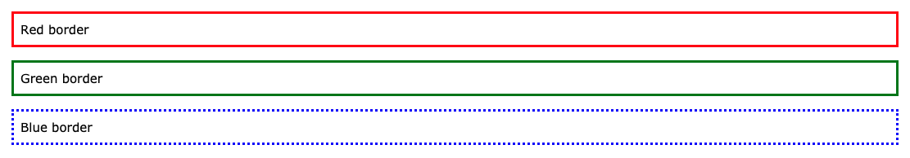

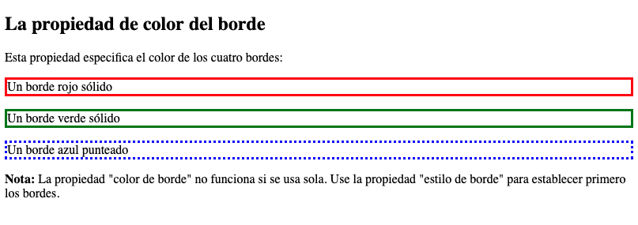

:computer:

### Especificar Side Colors

La propiedad `border-color` puede tener de uno a cuatro valores (para el top border, right border, bottom border, y el left border). 

#### Ejemplo

```css
p.one {
  border-style: solid;
  border-color: red green blue yellow; /* red top, green right, blue bottom and yellow left */
}
```

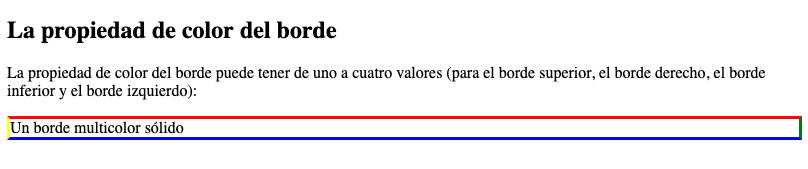

:computer:


### HEX Values

El color del borde también se puede especificar utilizando un valor hexadecimal (HEX):

#### Ejemplo

```css
p.one {
  border-style: solid;
  border-color: #ff0000; /* red */
}
```

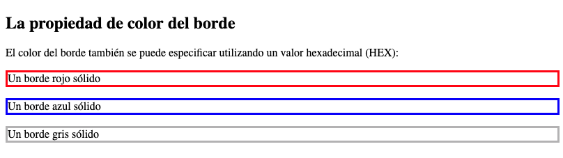

:computer:

### RGB Values

Usando valores RGB:

#### Ejemplo

```css
p.one {
  border-style: solid;
  border-color: rgb(255, 0, 0); /* red */
}
```

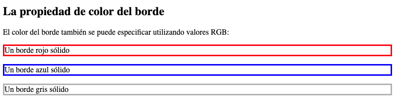

:computer:

### HSL Values

También puede usar valores HSL:

```css
p.one {
  border-style: solid;
  border-color: hsl(0, 100%, 50%); /* red */
}
```

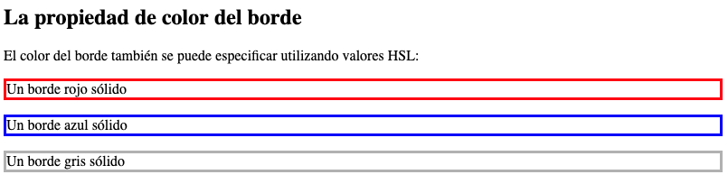

:computer:

## CSS Border Sides

### CSS Border - Individual Sides

En los ejemplos de las páginas anteriores, ha visto que es posible especificar un borde diferente para cada lado.

En CSS, también hay propiedades para especificar cada uno de los bordes (top, right, bottom y left):

#### Ejemplo

```css
p {
  border-top-style: dotted;
  border-right-style: solid;
  border-bottom-style: dotted;
  border-left-style: solid;
}
```
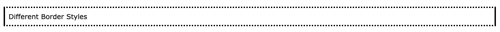

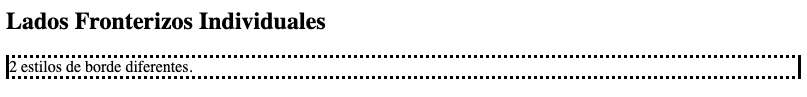

:computer:

El ejemplo anterior da el mismo resultado que este:

#### Ejemplo

```css
p {
  border-style: dotted solid;
}
```


:computer:

Pues así es como funciona:

Si la propiedad `border-style` tiene cuatro valores:

* **border-style: dotted solid double dashed;**
   * top border es dotted
   * right border es solid
   * bottom border es double
   * left border es dashed

Si la propiedad `border-style` tiene tres valores:

* **border-style: dotted solid double;**
   * top border es dotted
   * right y left borders son solid
   * bottom border es double
   
Si la propiedad `border-style`tiene dos valores:

* **border-style: dotted solid;**
   * top y bottom borders son dotted
   * right y left borders son solid

Si la propiedad `border-style` tiene un valor:

* **border-style: dotted;**
   * los cuatro borders son dotted

#### Ejemplo

```css
/* Four values */
p {
  border-style: dotted solid double dashed;
}

/* Three values */
p {
  border-style: dotted solid double;
}

/* Two values */
p {
  border-style: dotted solid;
}

/* One value */
p {
  border-style: dotted;
}
```

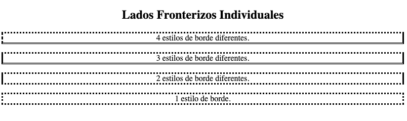

:computer:

La propiedad `border-style` se usa en el ejemplo anterior. Sin embargo, también funciona con `border-width` y `border-color`.

## CSS Shorthand Border Property

### CSS Border - Shorthand Property

Como viste en la página anterior, hay muchas propiedades a tener en cuenta al tratar con los bordes.

Para acortar el código, también es posible especificar todas las propiedades de borde individuales en una propiedad.

La propiedad `border` es una propiedad abreviada de las siguientes propiedades de borde individuales:

* `border-width`
* `border-style` (necesario)
* `border-color`
#### Ejemplo

```css
p {
  border: 5px solid red;
}
```

Resultado:

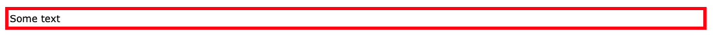

:computer:

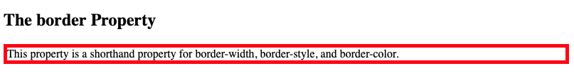

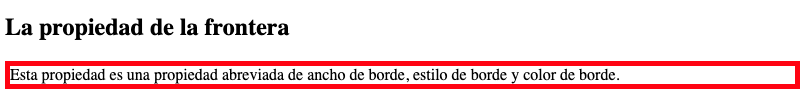

También puede especificar todas las propiedades de borde individuales para un solo lado:

### Left Border

```css
p {
  border-left: 6px solid red;
  background-color: lightgrey;
}
```

Resultado:

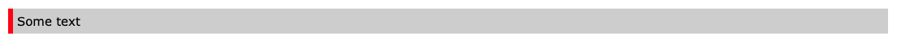

:computer:


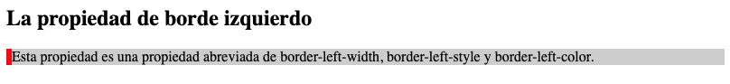

## CSS Rounded Borders

### CSS Rounded Borders

La propiedad `border-radius` se usa para agregar bordes redondeados a un elemento: 

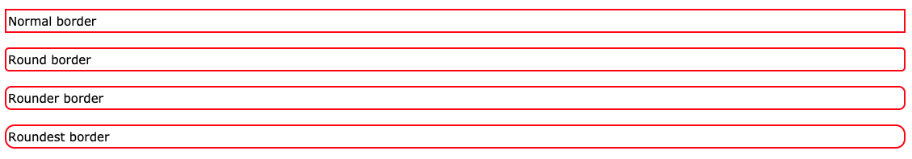

#### Ejemplo

```css
p {
  border: 2px solid red;
  border-radius: 5px;
}
```

:computer:

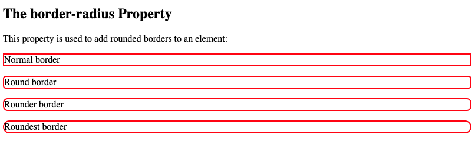

### Más ejemplos

[Todas las propiedades del borde superior en una declaración](https://www.w3schools.com/css/tryit.asp?filename=trycss_border-top)
Este ejemplo demuestra una propiedad abreviada para establecer todas las propiedades para el borde superior en una declaración.

[Establecer el estilo del borde inferior](https://www.w3schools.com/css/tryit.asp?filename=trycss_border-bottom-style)
Este ejemplo muestra cómo establecer el estilo del borde inferior.

[Establecer el ancho del borde izquierdo](https://www.w3schools.com/css/tryit.asp?filename=trycss_border-left-width)
Este ejemplo muestra cómo establecer el ancho del borde izquierdo.

[Establecer el color de los cuatro bordes](https://www.w3schools.com/css/tryit.asp?filename=trycss_border-color)
Este ejemplo muestra cómo establecer el color de los cuatro bordes. Puede tener de uno a cuatro colores.

[Establecer el color del borde derecho](https://www.w3schools.com/css/tryit.asp?filename=trycss_border-right-color)
Este ejemplo muestra cómo establecer el color del borde derecho.

### ¡Ponte a prueba con ejercicios!

:computer: :computer: :computer: :computer:

### Todas las Propiedades CSS Border

Propiedades |	Descripción
------------|------------
border | Establece todas las propiedades de border en una declaración
border-bottom | Establece todas las propiedades del bottom border en una declaración 
border-bottom-color | Establece el color del bottom border
border-bottom-style | Establece el style del bottom border
border-bottom-width | Establece el width del bottom border
border-color | Establece el color de los cuatro borders
border-left | Establece todas las propiedades del left border en una declaración
border-left-color | Establece el color del left border
border-left-style | Establece el style del left border
border-left-width | Establece el width del left border
border-radius | Establece las cuatro propiedades de border-*-radius para esquinas redondeadas
border-right | Establece todas las propiedades del right border en una declaración 
border-right-color | Establece el color del right border
border-right-style | Establece el style del right border
border-right-width | Establece el width del right border
border-style | Establece el style de los cuatro borders.
border-top | Establece todas las propiedades del top border en una declaración
border-top-color | Establece el color del border
border-top-style | Establece el style del top border
border-top-width | Establece el width del top border
border-width | Establece el width de los cuatro borders.

## CSS Margins

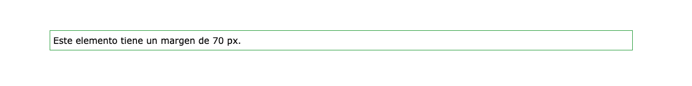 

:computer:

### CSS Margins

Las propiedades CSS `margin`  se utilizan para crear espacio alrededor de los elementos, fuera de los bordes definidos.

Con CSS, tienes control total sobre los márgenes. Hay propiedades para establecer el margen para cada lado de un elemento (top, right, bottom y left).

### Margin - Individual Sides

CSS tiene propiedades para especificar el margen para cada lado de un elemento:

* margin-top
* margin-right
* margin-bottom
* margin-left

Todas las propiedades margin pueden tener los siguientes valores:

* **auto** - el navegador calcula el margen
* **length** - especifica un margin en px, pt, cm, etc.
* **%** - especifica un margin en % del width del elemento contenedor
* **inherit** - especifica que el margin debe heredarse del elemento padre

**Tip**: Se permiten valores negativos.

#### Ejemplo

Establezca diferentes margins para los cuatro sides de un elemento `<p>`:

```css
p {
  margin-top: 100px;
  margin-bottom: 100px;
  margin-right: 150px;
  margin-left: 80px;
}
```

:computer:

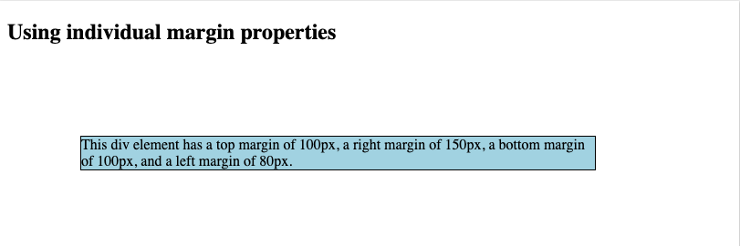 

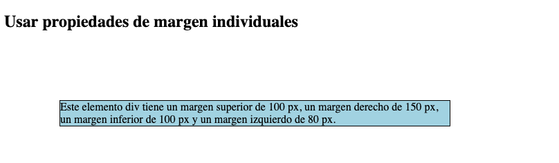 

### Margin - Shorthand Property

Para acortar el código, es posible especificar todas las propiedades de margen en una propiedad.

La propiedad `margin` es una propiedad abreviada de las siguientes propiedades de margen individuales:

* margin-top
* margin-right
* margin-bottom
* margin-left

Pues así es como funciona:

Si la propiedad `margin`tiene cuatro valores:

* **margin: 25px 50px 75px 100px;**
   * top margin es 25px
   * right margin es 50px
   * bottom margin es 75px
   * left margin es 100px

#### Ejemplo

Use la propiedad margin de forma reducida con cuatro valores:

```css
p {
  margin: 25px 50px 75px 100px;
}
```

:computer:

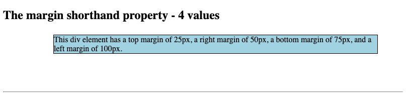 

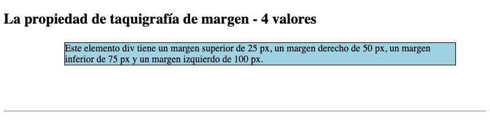 

Si la propiedad `margin` tiene tres valores:

* **margin: 25px 50px 75px;**
   * top margin es 25px
   * right y left margins son 50px
   * bottom margin es 75px

#### Ejemplo

Use la propiedad de taquigrafía de margen con tres valores: 

```css
p {
  margin: 25px 50px 75px;
}
```

:computer:

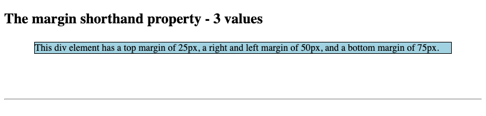 

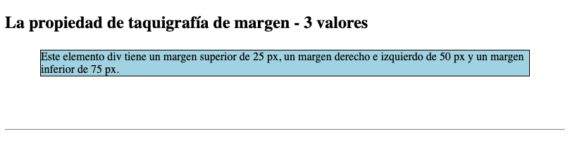 

Si la propiedad `margin` tiene dos valores:

* **margin: 25px 50px;**
   * top y bottom margins son 25px
   * right y left margins son 50px

#### Ejemplo

Use la propiedad de taquigrafía de margen con dos valores: 

```css
p {
  margin: 25px 50px;
}
```

:computer:

 

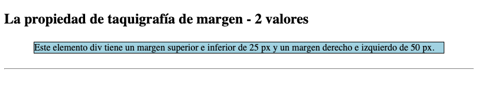

Si la propiedad `margin` tiene un valor:

* **margin: 25px;**
   * todos los cuatro margins son 25px
   
#### Example

Use la propiedad de taquigrafía de margen con un valor: 

```css
p {
  margin: 25px;
}
```

:computer:

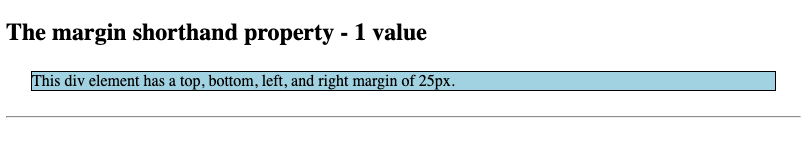 

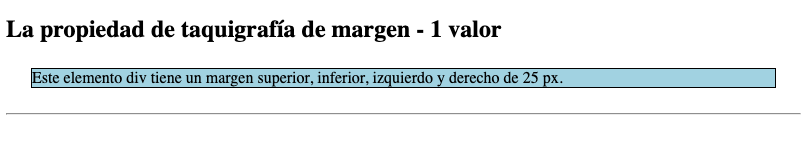

### El Valor `auto` 

Puede establecer la propiedad de margen `auto` para centrar horizontalmente el elemento dentro de su contenedor.

El elemento ocupará el ancho especificado y el espacio restante se dividirá en partes iguales entre los márgenes izquierdo y derecho.

#### Ejemplo

Uso margen: `auto:

```css
div {
  width: 300px;
  margin: auto;
  border: 1px solid red;
}
```

:computer:

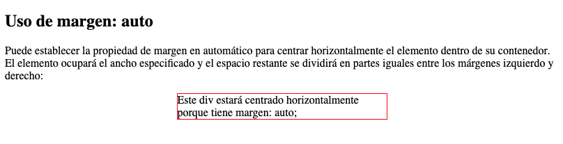

### El Valor `inherit`

Este ejemplo permite que el left margin del elemento `<p class="ex1">` se herede del elemento padre (`<div>`):

#### Ejemplo

Uso del valor `inherit`:

```css
div {
  border: 1px solid red;
  margin-left: 100px;
}

p.ex1 {
  margin-left: inherit;
}
```

:computer:

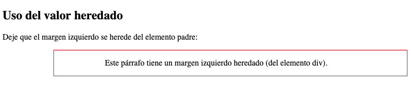

### Margin Collapse

Los márgenes superior e inferior de los elementos a veces se contraen en un único margen que es igual al mayor de los dos márgenes.

¡Esto no sucede en los márgenes izquierdo y derecho! ¡Solo márgenes superior e inferior!

Mira el siguiente ejemplo:

#### Ejemplo

Demostración de margin collapse:

```css
h1 {
  margin: 0 0 50px 0;
}

h2 {
  margin: 20px 0 0 0;
}
```

:computer:

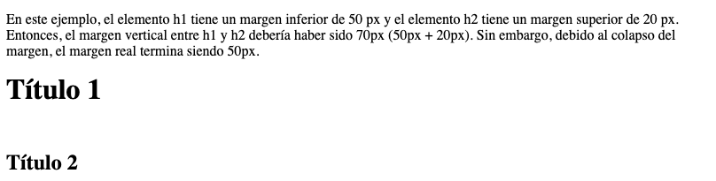

En el ejemplo anterior, el elemento `<h1>` tiene un margen inferior de `50px` y el elemento `<h2>` tiene un margen superior establecido en `20px`.

El sentido común parecería sugerir que el margen vertical entre `<h1>` y `<h2>` sería un total de `70px` (`50px` + `20px`). Pero debido al margin collapse, el margen real termina siendo `50px`.

### ¡Ponte a prueba con ejercicios!

:computer: :computer: :computer: :computer:

### Todas las Propiedades CSS Margin

Propiedad | Descripción
----------|------------
margin | Una propiedad abreviada para establecer las propiedades de margin en una declaración
margin-bottom | Establece el bottom margin de un elemento
margin-left | Establece el left margin de un elemento
margin-right | Establece el right margin de un elemento
margin-top | Establece el top margin de un elemento

## CSS Padding

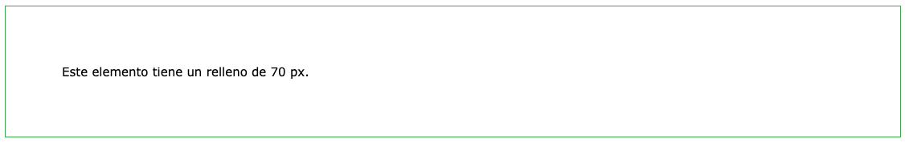

:computer:

### CSS Padding

Las propiedades CSS `padding` se utilizan para generar espacio alrededor del contenido de un elemento, dentro de cualquier borde definido.

Con CSS, tienes control total sobre el relleno. Hay propiedades para configurar el relleno para cada lado de un elemento (top, right, bottom y left).

### Padding - Individual Sides

CSS tiene propiedades para especificar el padding para cada lado de un elemento:

* padding-top
* padding-right
* padding-bottom
* padding-left

Todas las propiedades padding pueden tener los siguientes valores:

* **length** - especifica un padding en px, pt, cm, etc.
* **%** - especifica un padding en % del ancho del elemento contenedor
* **inherit** - especifica que el padding debe heredarse del elemento padre

**Nota**: los valores negativos no están permitidos.

#### Ejemplo

#### Ejemplo

Establezca un padding diferente para los cuatro lados de un elemento `<div>`:  

```css
div {
  padding-top: 50px;
  padding-right: 30px;
  padding-bottom: 50px;
  padding-left: 80px;
}
```

:computer:

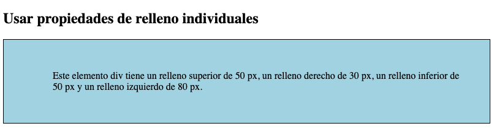

### Padding - Shorthand Property

Para acortar el código, es posible especificar todas las propiedades padding en una propiedad.

La propiedad `padding` es una propiedad abreviada de las siguientes propiedades padding individuales:

* padding-top
* padding-right
* padding-bottom
* padding-left

Pues así es como funciona:

Si la propiedad `padding` tiene cuatro valores:

* **padding: 25px 50px 75px 100px;**
   * top padding es 25px
   * right padding es 50px
   * bottom padding es 75px
   * left padding es 100px
   
#### Ejemplo

Utilice la propiedad recortada padding con cuatro valores:

```css
div {
  padding: 25px 50px 75px 100px;
}
```

:computer:

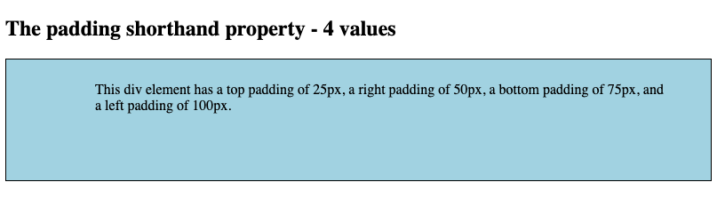

Si la propiedad padding tiene tres valores:

* **padding: 25px 50px 75px;**
   * top padding es 25px
   * right y left paddings son 50px
   * bottom padding es 75px
   
#### Ejemplo

Utilice la propiedad recortada padding con tres valores: 

```css
div {
  padding: 25px 50px 75px;
}
```

:computer:

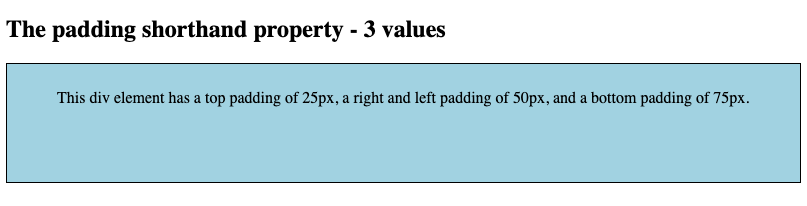

Si la propiedad padding tiene dos valores:

* **padding: 25px 50px;**
   * top y bottom paddings son 25px
   * right y left paddings son 50px

#### Ejemplo

Use la propiedad recortada padding con dos valores: 

```css
div {
  padding: 25px 50px;
}
```

:computer:

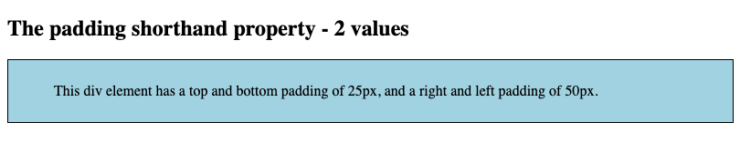

Si la propiedad padding tiene un valor:

* **padding: 25px;**
   * todos los cuatro paddings son 25px

#### Ejemplo

Utilice la propiedad recortada padding con un valor: 

```css
div {
  padding: 25px;
}
```

:computer:


### Padding y Elemento Width

La propiedad CSS width especifica el ancho del área de contenido del elemento. El área de contenido es la porción dentro del padding, border y margin de un elemento [el box model](https://www.w3schools.com/css/css_boxmodel.asp).

Entonces, si un elemento tiene un ancho específico, el padding agregado a ese elemento se agregará al ancho total del elemento. Esto es a menudo un resultado indeseable.

#### Ejemplo

Aquí, el elemento `<div>` tiene un ancho de `300px`. Sin embargo, el ancho real del elemento `<div>` será de `350px` (`300px` + `25px` de left padding + `25px` de right padding):

```css
div {
  width: 300px;
  padding: 25px;
}
```
:computer:

To keep the width at 300px, no matter the amount of padding, you can use the box-sizing property. This causes the element to maintain its width; if you increase the padding, the available content space will decrease.

Example
Use the box-sizing property to keep the width at 300px, no matter the amount of padding:

div {
  width: 300px;
  padding: 25px;
  box-sizing: border-box;
}
More Examples
Set the left padding
This example demonstrates how to set the left padding of a <p> element.

Set the right padding
This example demonstrates how to set the right padding of a <p> element.

Set the top padding
This example demonstrates how to set the top padding of a <p> element.

Set the bottom padding
This example demonstrates how to set the bottom padding of a <p> element.

Test Yourself with Exercises!
All CSS Padding Properties
Property	Description
padding	A shorthand property for setting all the padding properties in one declaration
padding-bottom	Sets the bottom padding of an element
padding-left	Sets the left padding of an element
padding-right	Sets the right padding of an element
padding-top	Sets the top padding of an element


## CSS Height/Width
## CSS Box Model
## CSS Outline
## CSS Text
## CSS Fonts
## CSS Icons
## CSS Links
## CSS Lists
## CSS Tables
## CSS Display
## CSS Max-width
## CSS Position
## CSS Overflow
## CSS Float
## CSS Inline-block
## CSS Align
## CSS Combinators
## CSS Pseudo-class
## CSS Pseudo-element
## CSS Opacity
## CSS Navigation Bar
## CSS Dropdowns
## CSS Image Gallery
## CSS Image Sprites
## CSS Attr Selectors
## CSS Forms
## CSS Counters
## CSS Website Layout
## CSS Units
## CSS Specificity
